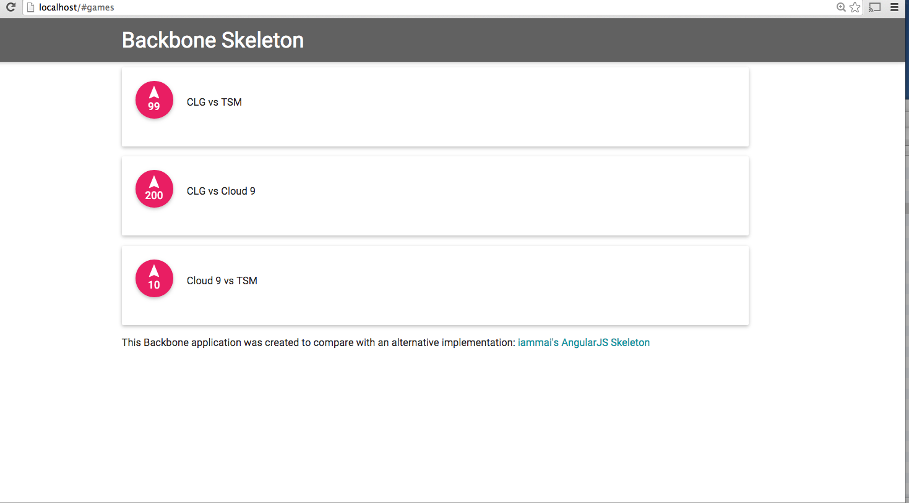

## Backbone Skeleton Application with RequireJS, Router, SCSS, Materialize

This project shows the layout and sample files of a maintainable Backbone application skeleton with the Backbone Router.
It uses RequireJS, SASS (SCSS), and Material Design repo Materialize.

This Backbone application was created to compare with an alternative implementation:
[iammai's AngularJS Skeleton](https://github.com/iammai/angular-skeleton-app-directive-example)


## Usage

The application can be run from any web host, simply clone the repo and point to your web host:

```bash
git clone https://github.com/iammai/backbone-skeleton-example-app.git
```


You should bee a similar view on your own browser:


#Tree

Tree folder structure

```bash
$ tree
.
├── README.md
├── app
│   ├── collections
│   │   └── game_collection.js
│   ├── data
│   │   └── games.json
│   ├── helpers
│   │   ├── general_helper.js
│   │   └── utility_helper.js
│   ├── models
│   │   └── game.js
│   ├── templates
│   │   └── games_template.hb
│   └── views
│       └── game_view.js
├── app.js
├── assets
│   ├── img
│   ├── js
│   │   ├── backbone-min.js
│   │   ├── backbone.js
│   │   ├── handlebars.js
│   │   ├── jquery-1.9.1.js
│   │   ├── jquery-1.9.1.min.js
│   │   ├── underscore-min.js
│   │   └── underscore.js
│   ├── libs
│   │   ├── backbone-validation.js
│   │   ├── jquery.cookie.js
│   │   ├── materialize
│   │   │   ├── CHANGELOG.md
│   │   │   ├── LICENSE
│   │   │   ├── bin
│   │   │   │   ├── materialize.css
│   │   │   │   └── materialize.js
│   │   │   ├── bower.json
│   │   │   ├── dist
│   │   │   │   ├── css
│   │   │   │   │   ├── materialize.css
│   │   │   │   │   ├── materialize.css.map
│   │   │   │   │   └── materialize.min.css
│   │   │   │   ├── font
│   │   │   │   │   ├── material-design-icons
│   │   │   │   │   │   ├── Material-Design-Icons.eot
│   │   │   │   │   │   ├── Material-Design-Icons.svg
│   │   │   │   │   │   ├── Material-Design-Icons.ttf
│   │   │   │   │   │   └── Material-Design-Icons.woff
│   │   │   │   │   └── roboto
│   │   │   │   │       ├── Roboto-Bold.ttf
│   │   │   │   │       ├── Roboto-Light.ttf
│   │   │   │   │       ├── Roboto-Medium.ttf
│   │   │   │   │       ├── Roboto-Regular.ttf
│   │   │   │   │       └── Roboto-Thin.ttf
│   │   │   │   └── js
│   │   │   │       ├── materialize.js
│   │   │   │       └── materialize.min.js
│   │   │   ├── font
│   │   │   │   ├── material-design-icons
│   │   │   │   │   ├── Material-Design-Icons.eot
│   │   │   │   │   ├── Material-Design-Icons.svg
│   │   │   │   │   ├── Material-Design-Icons.ttf
│   │   │   │   │   └── Material-Design-Icons.woff
│   │   │   │   └── roboto
│   │   │   │       ├── Roboto-Bold.ttf
│   │   │   │       ├── Roboto-Light.ttf
│   │   │   │       ├── Roboto-Medium.ttf
│   │   │   │       ├── Roboto-Regular.ttf
│   │   │   │       └── Roboto-Thin.ttf
│   │   │   ├── js
│   │   │   │   ├── animation.js
│   │   │   │   ├── buttons.js
│   │   │   │   ├── cards.js
│   │   │   │   ├── collapsible.js
│   │   │   │   ├── date_picker
│   │   │   │   │   ├── picker.date.js
│   │   │   │   │   └── picker.js
│   │   │   │   ├── dropdown.js
│   │   │   │   ├── forms.js
│   │   │   │   ├── hammer.min.js
│   │   │   │   ├── jquery.easing.1.3.js
│   │   │   │   ├── jquery.hammer.js
│   │   │   │   ├── jquery.timeago.min.js
│   │   │   │   ├── leanModal.js
│   │   │   │   ├── materialbox.js
│   │   │   │   ├── parallax.js
│   │   │   │   ├── pushpin.js
│   │   │   │   ├── scrollFire.js
│   │   │   │   ├── scrollspy.js
│   │   │   │   ├── sideNav.js
│   │   │   │   ├── slider.js
│   │   │   │   ├── tabs.js
│   │   │   │   ├── toasts.js
│   │   │   │   ├── tooltip.js
│   │   │   │   ├── transitions.js
│   │   │   │   ├── velocity.min.js
│   │   │   │   └── waves.js
│   │   │   ├── sass
│   │   │   │   ├── components
│   │   │   │   │   ├── _buttons.scss
│   │   │   │   │   ├── _cards.scss
│   │   │   │   │   ├── _collapsible.scss
│   │   │   │   │   ├── _color.scss
│   │   │   │   │   ├── _dropdown.scss
│   │   │   │   │   ├── _form.scss
│   │   │   │   │   ├── _global.scss
│   │   │   │   │   ├── _grid.scss
│   │   │   │   │   ├── _icons-material-design.scss
│   │   │   │   │   ├── _materialbox.scss
│   │   │   │   │   ├── _mixins.scss
│   │   │   │   │   ├── _modal.scss
│   │   │   │   │   ├── _navbar.scss
│   │   │   │   │   ├── _normalize.scss
│   │   │   │   │   ├── _prefixer.scss
│   │   │   │   │   ├── _preloader.scss
│   │   │   │   │   ├── _roboto.scss
│   │   │   │   │   ├── _sideNav.scss
│   │   │   │   │   ├── _slider.scss
│   │   │   │   │   ├── _table_of_contents.scss
│   │   │   │   │   ├── _tabs.scss
│   │   │   │   │   ├── _toast.scss
│   │   │   │   │   ├── _tooltip.scss
│   │   │   │   │   ├── _typography.scss
│   │   │   │   │   ├── _variables.scss
│   │   │   │   │   ├── _waves.scss
│   │   │   │   │   └── date_picker
│   │   │   │   │       ├── _default.date.scss
│   │   │   │   │       ├── _default.scss
│   │   │   │   │       └── _default.time.scss
│   │   │   │   └── materialize.scss
│   │   │   └── templates
│   │   │       ├── parallax-template
│   │   │       │   ├── LICENSE
│   │   │       │   ├── background1.jpg
│   │   │       │   ├── background2.jpg
│   │   │       │   ├── background3.jpg
│   │   │       │   ├── css
│   │   │       │   │   └── style.css
│   │   │       │   └── js
│   │   │       │       └── init.js
│   │   │       └── starter-template
│   │   │           ├── LICENSE
│   │   │           ├── css
│   │   │           │   └── style.css
│   │   │           └── js
│   │   │               └── init.js
│   │   ├── require.js
│   │   └── require.min.js
│   └── styles
│       ├── css
│       │   └── styles.css
│       └── sass
│           ├── components
│           │   └── _home.scss
│           ├── styles.css
│           └── styles.scss
├── backbone-skeleton-example.png
├── config.js
├── index.html
├── main.js
├── router.js
└── text.js
```